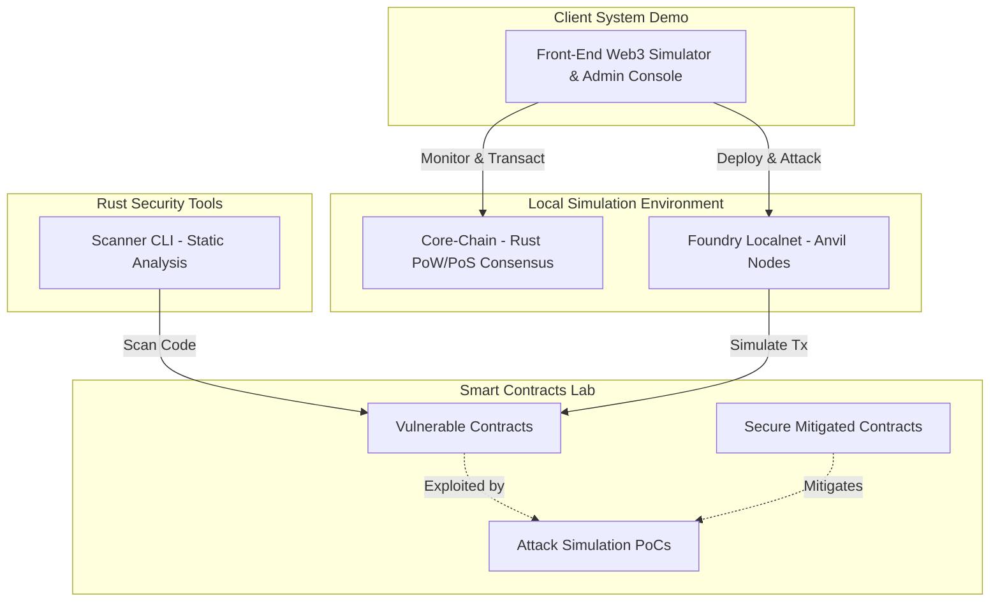

# 🛡️ CryptoSec Lab — Web3 Security & Audit Laboratory

[](https://www.rust-lang.org/)
[](https://soliditylang.org/)
[](https://book.getfoundry.sh/)
[](https://nextjs.org/)
[](https://github.com/)
[](https://github.com/)

An educational blockchain security and smart contract auditing laboratory designed for learning, testing, and demonstrating Web3 vulnerabilities, exploits, and defensive programming patterns.

---

> [!WARNING]
> **EDUCATIONAL PURPOSES ONLY**
> * All smart contract exploits and chain attacks are executed in simulated, isolated local networks.
> * There is **NO** mainnet connection. Never input real credentials, private keys, or actual wallet seed phrases.
> * Refer to the [General Disclaimer](file:///D:/Prg/CryptoSec-Lab/DISCLAIMER.md) and [Ethical Use Agreement](file:///D:/Prg/CryptoSec-Lab/ETHICAL_USE.md) before executing any script.

---

## 🏗️ Architecture Overview

The laboratory connects local blockchain simulations, static contract scanning in Rust, and a Vercel/Linear-inspired auditing dashboard.



---

## 📁 Repository Structure

```
cryptosec-lab/
  ├── core-chain/           # Blockchain core engine in Rust (PoW + PoS consensus)
  ├── vulnerable-chain/     # Weak blockchain consensus simulations (Weak Hash, 51%)
  ├── contracts/            # Smart contracts Solidity + Foundry test suites
  │    ├── src/vulnerable/  # Basic vulnerable Solidity contracts
  │    ├── src/secure/      # Secure Solidity contracts with mitigations
  │    ├── src/advanced/    # Advanced vulnerabilities (Read-only Reentrancy, etc.)
  │    └── test/            # Foundry exploit tests
  ├── scanner/              # Static analysis scanner CLI written in Rust
  ├── frontend-simulator/   # Premium Next.js Admin Console & UI simulator
  ├── exploits/             # Comprehensive walkthroughs of each vulnerability
  ├── audits/               # Audit templates, checklists, and delivery templates
  └── portfolio/            # B2B Go-To-Market Sales Enablement assets & decks
```

---

## ⚡ Quick Start

### 1. Prerequisites
Ensure you have the following installed:
* [Rust compiler](https://rustup.rs/) (Edition 2021)
* [Foundry](https://book.getfoundry.sh/getting-started/installation) (`forge`, `anvil`)
* [Node.js](https://nodejs.org/) (v18+)

---

### 2. Smart Contracts & Exploits (Foundry)
Compile the Solidity contracts and execute the entire exploit test suite:
```bash
cd contracts
# Run all Foundry tests (including reentrancy, oracle manipulations, and sandwich attacks)
C:\Users\User\.foundry\bin\forge.exe test -vvv
```

---

### 3. Rust Blockchain Core & Scanner
Compile the Rust tools:
```bash
# Run consensus and scanner unit tests
cargo test --workspace

# Run static analysis contract scanner
cargo run -p scanner -- contracts/src/vulnerable/VulnerableBank.sol
```

---

### 4. Premium Admin Console (Next.js)
Start the Next.js visual simulator and access the administrative auditing portal:
```bash
cd frontend-simulator
npm install
npm run dev
```
Open [http://localhost:3000](http://localhost:3000) for the lab simulator, and navigate to `/admin/overview` to review the B2B administrative audit dashboard.

---

## 💼 Modules Detail

### 1. Core-Chain & Vulnerable-Chain (Rust)
A modular blockchain ledger designed to showcase lower-level protocol attacks:
* **Double Spend** (no nonce verification)
* **Replay Attacks** (no chain ID verification)
* **51% Attack** (longest chain replacement simulation)
* **Timestamp Manipulation** (permissive block validation)

### 2. Smart Contracts Laboratory (Solidity + Foundry)
Dozens of mock scenarios detailing vulnerabilities, attacks, and their corresponding secure defenses:
* **Basic**: Reentrancy, Access Control, Oracle Manipulation, Flash Loans, Bad Randomness, Unprotected Approvals.
* **Advanced**: Permit Replay (EIP-2612), Read-only Reentrancy, Cross-function Reentrancy, Proxy Storage Collision, Vault Share Inflation (First Depositor Attack), Fee-on-Transfer Accounting.

### 3. Visual Simulator & Admin Console (Next.js)
* **Visual Lab**: Interactive dashboards to trigger double spends, mine blocks, spam mempool, and execute DEX sandwich attacks.
* **Premium Admin Console**: A portal styled after Vercel/Tenderly to manage security reviews, audit findings, report generation pipelines, and client risk portfolios.

---

## 🗺️ Roadmap & Progress

- [x] **Phase 1**: Rust Blockchain Core and consensus rules.
- [x] **Phase 2**: Vulnerable Chain protocol exploits.
- [x] **Phase 3**: Solidity Smart Contract vulnerability catalog.
- [x] **Phase 4**: DeFi/DEX security labs (AMM, Lending, Bridge Replays).
- [x] **Phase 5**: Next.js Visual Simulator & UI Playground.
- [x] **Phase 6**: Sales Enablement and B2B security portfolio.
- [x] **Phase 7**: Premium Admin Console, .gitattributes, and Advanced Exploit Packs.

---

## 📄 License & Ethical Use
This repository is licensed under the MIT License. You must comply with the terms of the [Ethical Use Agreement](file:///D:/Prg/CryptoSec-Lab/ETHICAL_USE.md) at all times.
