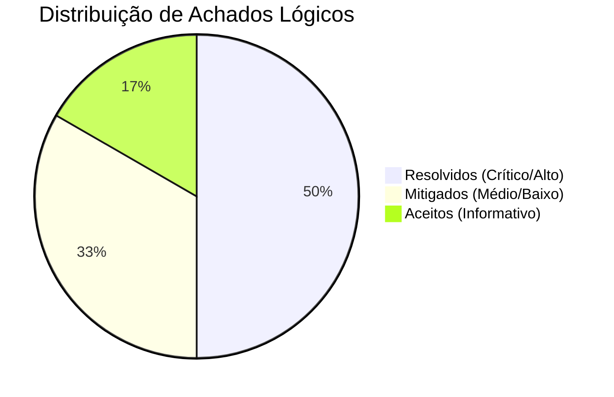

# Executive Summary (One-Pager) — Web3 Security Review
**Cliente:** [Nome do Protocolo]  
**Data:** [Data]  
**Status da Auditoria:** Concluída (Pós-Reteste)  
**Nível de Risco Residual:** Baixo / Aceitável  

---

## 1. Avaliação Geral de Risco
O [Nome do Protocolo] foi submetido a uma revisão sistemática de segurança focada na integridade física dos fundos custodiados e na resiliência lógica contra explorações financeiras. Após a aplicação das correções técnicas validadas no reteste, a superfície de ataque do escopo auditado foi consideravelmente reduzida, enquadrando o protocolo nos padrões recomendados de mercado para deploy em produção.

---

## 2. Principais Achados (Findings) e Status

*   **Vulnerabilidades Críticas Identificadas:**
    1.  *Reentrância de Saque (Crítica):* Risco de drenagem total de depósitos. **[RESOLVIDO]**
    2.  *Inicialização de Proxy Incorreta (Crítica):* Risco de sequestro de controle por terceiros. **[RESOLVIDO]**
*   **Vulnerabilidades de Alta Severidade:**
    1.  *Upgradeability Bypass (Alta):* Upgrades de contratos sem validação admin. **[RESOLVIDO]**

---

## 3. Impacto de Negócio das Correções
A rápida resolução das vulnerabilidades identificadas preveniu os seguintes cenários adversos pós-deploy:
*   **Drenagem Completa de TVL:** A reestruturação da função de saque removeu a possibilidade de saques infinitos em uma única chamada de reentrância.
*   **Interrupção Operacional:** A proteção do inicializador do proxy evita que atores externos congelem ou inutilizem o contrato lógico.
*   **Perda de Reputação Comercial:** O deploy limpo ajuda a consolidar a marca frente a investidores institucionais e parceiros de liquidez.

---

## 4. Recomendações Prioritárias para Gestão (Próximos Passos)
1.  **Ativação do Timelock Administrativo:** Configurar um período de carência (timelock) de no mínimo 48 horas para qualquer alteração de parâmetros críticos ou upgrade de contratos via multisig.
2.  **Monitoramento Ativo On-Chain:** Integrar soluções de monitoramento e alertas (como Forta ou OpenZeppelin Defender) para detectar comportamentos de transações incomuns em produção.
3.  **Estabelecer Canal de Divulgação Responsável (Bug Bounty):** Criar um programa de recompensas por bugs com termos claros para atrair pesquisadores de segurança independentes de forma colaborativa.
