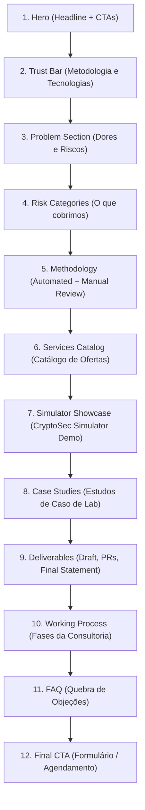

# Landing Page Sections & Wireframe Layout

Este documento descreve a organização e o fluxo visual de seções recomendado para a Landing Page comercial da nossa consultoria de segurança Web3.

---

## Estrutura do Layout (Fluxo de Cima para Baixo)

---

## Detalhamento de Seções e Componentes UI

### 1. Hero Section (Abertura)
*   **Elementos UI:** Fundo escuro com grade vetorial sutil, tipografia monoespaçada fina para tags ("// Web3 Security Audit"), headline de alta legibilidade, subheadline em cinza claro, botões primário (gradiente premium) e secundário (borda sutil).

### 2. Trust & Credibility Bar
*   **Elementos UI:** Logomarcas em tons de cinza fosco das tecnologias suportadas (Solidity, Rust, Foundry, Next.js, OpenZeppelin) dispostas em linha horizontal limpa, transmitindo alinhamento técnico.

### 3. Problem Section (Dor do Cliente)
*   **Elementos UI:** Bloco com tipografia destacada em tamanho maior. Um layout de duas colunas: a esquerda contém a dor institucional (hacks recorrentes e perdas financeiras) e a direita contém estatísticas reais de exploits DeFi da indústria.

### 4. Risk Categories (Áreas de Auditoria)
*   **Elementos UI:** Grade de cartões (4 colunas) com efeito glassmorphism (vidro fosco) e hover animado contendo ícones vetoriais finos de cada área de risco: Smart Contracts, DeFi Pools, Cross-chain Bridges, MPC Custody.

### 5. Methodology (Nossa Abordagem)
*   **Elementos UI:** Layout dividido ao meio. Lado esquerdo explica a triagem rápida por scanners heurísticos; lado direito destaca a análise manual profunda por engenheiros sêniores. Utilizar pequenas janelas de código simuladas (fenced code blocks estilizados) como suporte visual.

### 6. Services Catalog (Ofertas de Serviços)
*   **Elementos UI:** Tabela ou conjunto de blocos de preços/serviços minimalistas mostrando o alinhamento de escopos (Starter, Standard, Advanced, Custom Retainer) sem a necessidade de expor valores fixos obrigatórios, apenas botões de consulta de orçamento para cada card.

### 7. Simulator Showcase (O Simulador de Ameaças)
*   **Elementos UI:** Captura de tela simulada de alta resolução do **Frontend Simulator** rodando (exibindo gráficos de TVL e logs de transações adversárias). Destaque para um vídeo curto interativo ou iframe demonstrativo do simulador em funcionamento.

### 8. Case Studies (Estudos de Caso de Laboratório)
*   **Elementos UI:** Carrossel horizontal ou lista de abas permitindo alternar entre os 6 estudos de caso de laboratório. Cada aba exibe o problema, a PoC de exploit simulada e a mitigação estrutural implementada.

### 9. Deliverables (Entregáveis Premium)
*   **Elementos UI:** Visualização em mockup do PDF do Relatório Técnico, dos Pull Requests de mitigação abertos no GitHub e do selo minimalista de Declaração de Conclusão (Completion Statement).

### 10. Working Process (Linha do Tempo)
*   **Elementos UI:** Linha do tempo vertical animada contendo os 4 estágios da cooperação técnica (Kick-off & Scope Freeze, Deep Audit & PoC, Correction Window, Retest & Final Report).

### 11. FAQ (Perguntas Frequentes)
*   **Elementos UI:** Componentes de sanfona (accordion) interativos de abertura e fechamento suave para as dúvidas do cliente, garantindo legibilidade e contorno imediato de objeções de preço e prazo.

### 12. Final CTA (Fechamento)
*   **Elementos UI:** Seção de rodapé destacada com gradiente suave nas bordas, formulário simplificado de contato (Nome, E-mail, Repositório do GitHub, Prazos) e link direto para agendador de chamadas (ex: Calendly).
