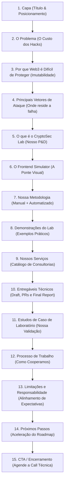

# Pitch Deck Outline — Web3 Security Presentation

Esta estrutura de apresentação foi desenhada para reuniões comerciais de 15 a 20 minutos com founders, diretores de tecnologia e investidores Web3, contendo 15 lâminas estruturadas para engajamento e conversão.

---

## Estrutura de Slides (15 Lâminas)

---

## Resumo dos Objetivos de Cada Bloco

### Bloco 1: Conexão e Dor (Slides 1 a 4)
*   *Objetivo:* Chamar a atenção do interlocutor para os riscos latentes on-chain e traduzir falhas de código em impacto financeiro e reputacional direto.

### Bloco 2: A Solução e Metodologia (Slides 5 a 8)
*   *Objetivo:* Apresentar o **CryptoSec Lab** e o **Frontend Simulator** como diferenciais técnicos e metodológicos que trazem visibilidade clara aos problemas.

### Bloco 3: Oferta Comercial e Processo (Slides 9 a 12)
*   *Objetivo:* Explicar de forma transparente os serviços oferecidos, o que é entregue, como funciona o cronograma de cooperação e provar nossa capacidade por meio de estudos de caso.

### Bloco 4: Fechamento e Alinhamento (Slides 13 a 15)
*   *Objetivo:* Desmistificar claims irreais através de disclaimers honestos de limitação de responsabilidade, desenhar o caminho imediato para início e incentivar o agendamento da call de descoberta técnica.
