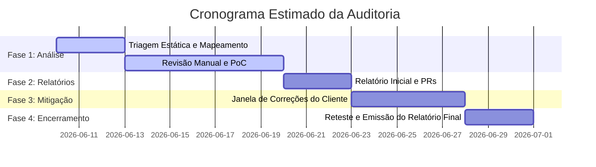

# Proposta de Revisão de Segurança Web3 (Proposal Template)
**Cliente:** [Nome do Cliente / Protocolo]  
**Data:** [Data de Emissão]  
**Validade da Proposta:** 15 dias  

---

## 1. Introdução e Visão Geral
Esta proposta detalha a prestação de serviços de consultoria em segurança blockchain e auditoria de contratos inteligentes a ser realizada pela nossa equipe para o [Nome do Protocolo]. Focamos em identificar vulnerabilidades lógicas de código, avaliar riscos econômicos de integração e mitigar vetores de ataque antes que o protocolo realize o deploy em ambiente de produção (mainnet).

## 2. Objetivo da Análise
O objetivo principal da auditoria é reduzir a superfície de ataque dos contratos inteligentes do cliente. Nossa revisão visa avaliar se a lógica de negócios implementada se comporta conforme documentado e se os privilégios administrativos e fluxos de fundos estão robustamente protegidos contra agentes adversários.

## 3. Escopo Técnico

### Em Escopo:
A análise incide exclusivamente sobre o repositório de código-fonte especificado sob as seguintes condições:
*   **Repositório:** `https://github.com/[cliente]/[repositorio]`
*   **Commit Hash Congelado:** `[inserir_hash_especifico_aqui]`
*   **Arquivos do Escopo:**
    *   `src/contracts/[NomeDoContrato1].sol` — [Breve Descrição de Função]
    *   `src/contracts/[NomeDoContrato2].sol` — [Breve Descrição de Função]
*   **Volume de Código Estimado:** Aproximadamente `[X]` Linhas de Código (nLoC).

### Fora de Escopo:
*   Frontend, interfaces web e integrações de API off-chain (a menos que contratado separadamente).
*   Versões do código modificadas após o início dos trabalhos.
*   Segurança física e de infraestrutura dos validadores ou da nuvem corporativa do cliente.

---

## 4. Metodologia de Trabalho
Nossa metodologia combina rigor automatizado e profunda análise intelectual:
1.  **Triagem Estática Automatizada:** Execução de scanners internos heurísticos e linters de segurança para remoção de falhas sintáticas básicas.
2.  **Análise de Fluxo de Controle e Dados:** Mapeamento visual das transições de estados dos contratos e chamadas de funções.
3.  **Auditoria Manual de Código (Deep Review):** Revisão linha a linha conduzida por engenheiros de segurança sêniores focada em lógica proprietária.
4.  **Criação de Testes Adversários (PoC):** Escrita de cenários de teste que validam exploits teóricos no framework Foundry.

---

## 5. Cronograma e Fases

*   **Duração Total Estimada:** `[X]` semanas úteis a partir da confirmação do pagamento inicial e concessão de acessos.

---

## 6. Entregáveis
*   **Draft Report (Relatório Preliminar):** Lista preliminar de achados classificados por gravidade (Crítica, Alta, Média, Baixa, Informativa), acompanhados de recomendações de mitigação.
*   **Pull Requests / Propostas de Mitigação:** Auxílio técnico com sugestões de código corretivo enviadas diretamente em branch específico.
*   **Relatório Final de Auditoria:** Documento consolidado com a descrição das vulnerabilidades, código das PoCs do exploit, status final de cada vulnerabilidade após o reteste e declaração de encerramento da revisão.

---

## 7. Responsabilidades do Cliente e Premissas
*   **Congelamento do Escopo (Code Freeze):** O cliente concorda em não realizar pushes de novas funcionalidades no repositório de auditoria após o início dos trabalhos. Modificações durante a análise cancelam o cronograma atual ou incorrem em custos adicionais.
*   **Suporte Técnico Dedicado:** O cliente indicará um canal de comunicação direta (ex: Slack ou Telegram) com o desenvolvedor responsável pela arquitetura para resolução de dúvidas pontuais.

---

## 8. Investimento e Condições Financeiras
O investimento total estimado para o escopo delimitado nesta proposta é definido abaixo:

*   **Modalidade:** Preço Fixo (Fixed Price) baseado na complexidade dos contratos.
*   **Valor do Investimento:** USD `[Inserir Valor]` ou equivalente em stablecoins (USDC/USDT).
*   **Condição de Pagamento:** 50% no início dos trabalhos (kick-off) e 50% na entrega do Relatório Preliminar (antes do reteste).
*   **Reteste Incluso:** Esta proposta inclui 1 (uma) rodada de reteste das correções aplicadas no repositório de auditoria original, desde que executadas em até 10 dias após a entrega do Relatório Preliminar.

---

## 9. Disclaimer de Risco (Limitação de Responsabilidade)
*   Uma auditoria de contratos inteligentes é um parecer técnico de avaliação de risco com base em metodologias vigentes. Ela reduz de forma expressiva a probabilidade de falhas e explorações, mas **não fornece garantia absoluta** de imunidade contra bugs, falhas futuras ou perdas financeiras.
*   A nossa equipe não assume responsabilidade jurídica sobre o desempenho econômico do protocolo ou eventuais desvalorizações e oscilações do mercado de criptoativos.

---

## 10. Próximos Passos
Para dar início ao projeto:
1.  Assinatura do Acordo de Confidencialidade (NDA) mútuo se necessário.
2.  Assinatura desta proposta comercial.
3.  Concessão de acessos de leitura ao repositório do GitHub.
4.  Agendamento da call técnica de kick-off.
